<!-- 

      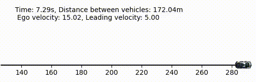

 -->
<!-- 

    

        
    

    

        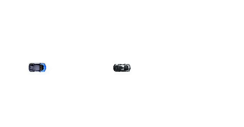
    

 -->

  
  
  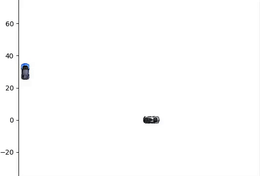
  

## 📊 Results
### 📈 Adaptive Cruise Control

      

      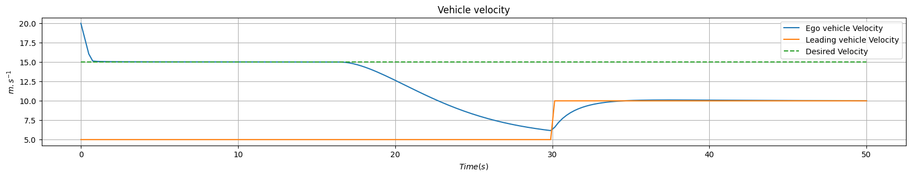

### 📈 Trajectory tracking (using Linear MPC)

      

### 📈 Car Overtaking (using Non-Linear MPC)

      

      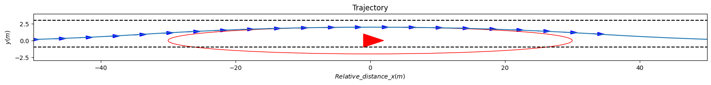

### 📈 Drag Racing (using Non-Linear MPC)
- Case 1:

      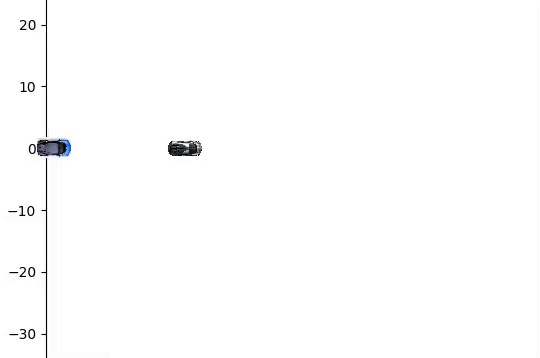

      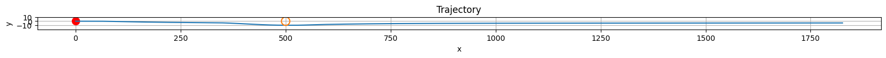

- Case 2:

      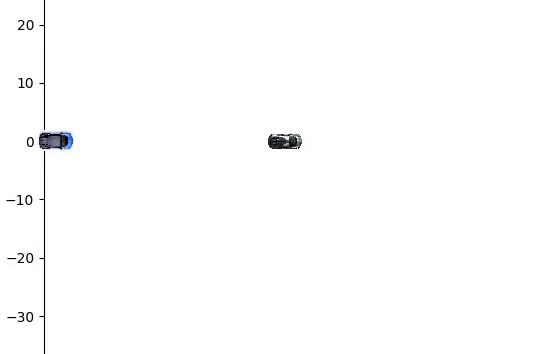

      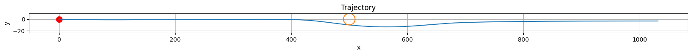

- Case 3:

      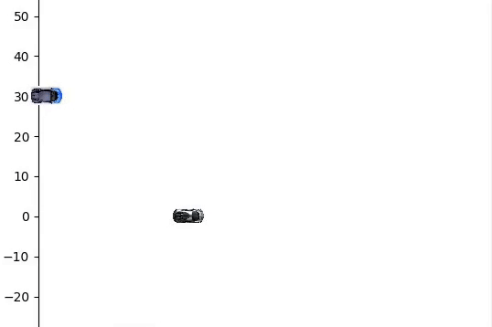

      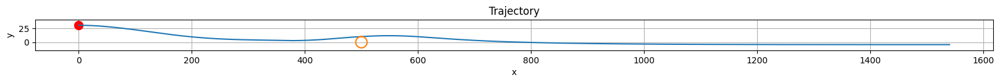

- Case 4:

      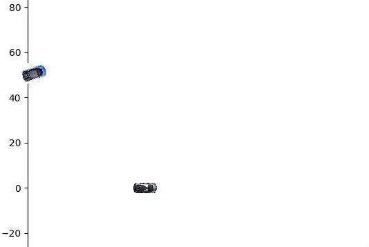

      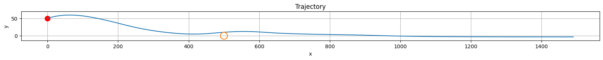

- Case 5:

      

      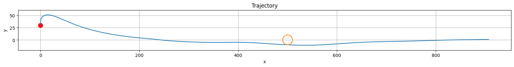

### 📈 Image Classification (Cars vs Person vs None)
- Challenging because low-resolution 32x32 blurry RGB images...still achieved 90% accuracy

      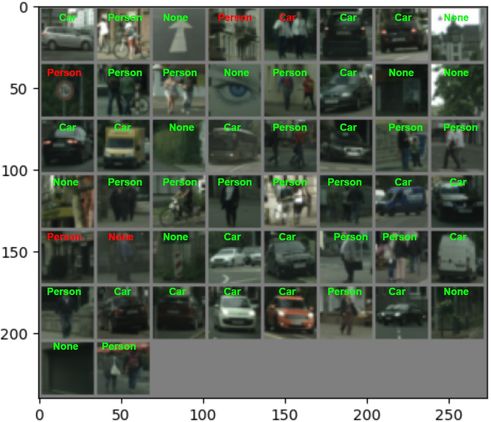

### 📈 Object Detection (Traffic sign Detection)
- Achieved ~48 mAP with an average FPS of 43

      

### 📈 Scene segmentation (Comprising 14 classes from urban scenario + background class)
- Achieved 81.2 mIoU

  
  

